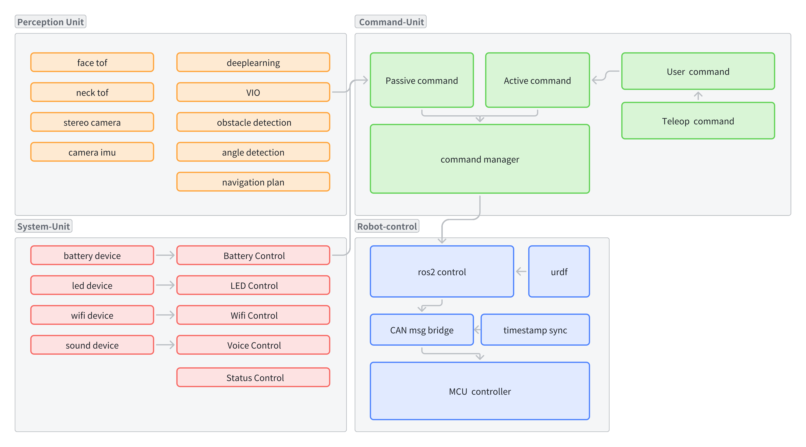

> # Welcome to Vulcan-Robot-Architecture Documentation!

```{toctree}
:maxdepth: 1
pages/Robot-Control
pages/Perception-Unit
pages/Command-Unit
pages/System-Unit
pages/Test-Unit
pages/Code-Format
```

## 简介



------

这是一个基于`ROS2`的软件框架。其中描述了一个机器人所包含的各个模块之间的消息连接，开发规范以及测试方法。

```markdown
`ros2` 并不只是一个通信接口，而是大家约定俗成的一套开发流程及数据格式。机器人是一个复杂的系统，如果只是将一个个功能堆叠在一起，增加一个需求就去增加一个节点。需要发布 `ros2` 的消息，就去自定义一个 `msg`，这样虽然是可行的，且这也是 `ros2` 的优势。但是一旦功能不断增多，许多功能就会乱做一团，因为 `ros2` 只是保证机器人系统各个节点之间的数据能够通信，而机器人的控制逻辑则需要开发者自己去管理。
```

​	如果在开发之初就没有做好各个功能模块的规划，及开发代码流程的规范，那就会造成维护难度大，`debug` 困难的局面。且自定义`msg` 在 `Rviz2` 和 `rqt` 中都需要做额外的工作才能让其正常的显示。对于机器人这个系统，尤其是移动端机器人，在没有可视化的情况下，对于真实环境运动出现的问题是很难调试的。

- [指令管理器单元](./pages/Command-Unit.md)
- [感知控制器单元](./pages/Perception-Unit.md)
- [运动控制器单元](./pages/Robot-Control.md)
- [系统任务单元](./pages/System-Unit.md)
- [测试流程单元](./pages/Test-Unit.md)
- [Ros代码规范](./pages/Code-Format.md)

### 致谢

```{note}
感谢那些和我一起工作的兄弟姐妹们，是你们的吐槽让我完善了这个文档。这个框架仅代表我当前对 ROS2 机器人的理解。后续也将不断的去改进现在的框架。
```